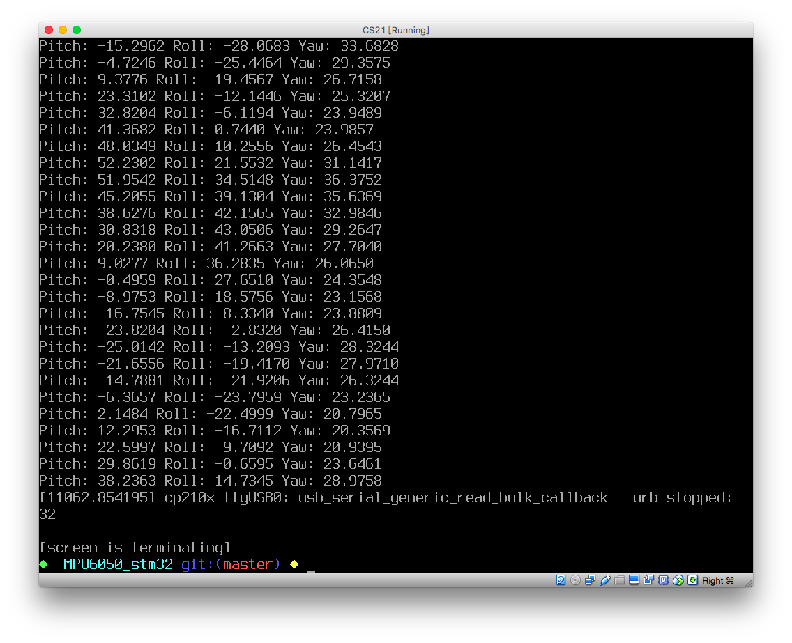
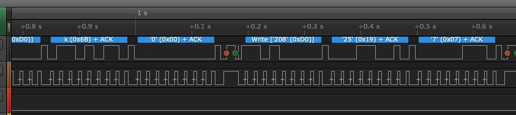
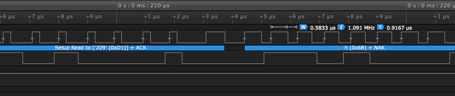

# Screen Shot



```
#define SCL BIT_ADDR((GPIOB_BASE+12), 15)
#define SDA BIT_ADDR((GPIOB_BASE+12), 13)
#define AD0 BIT_ADDR((GPIOC_BASE+12), 6)

#define GPIOB_IDR_Addr (GPIOB_BASE + 8)
#define READ_SDA BIT_ADDR(GPIOB_IDR_Addr, 13)
```

# I2C




Speed Upgrade to 500kHz~1Mhz

# Connect Status

```
    LED1 = MPU_Sigle_Read(WHO_AM_I) == 0x68?0:1;
```

